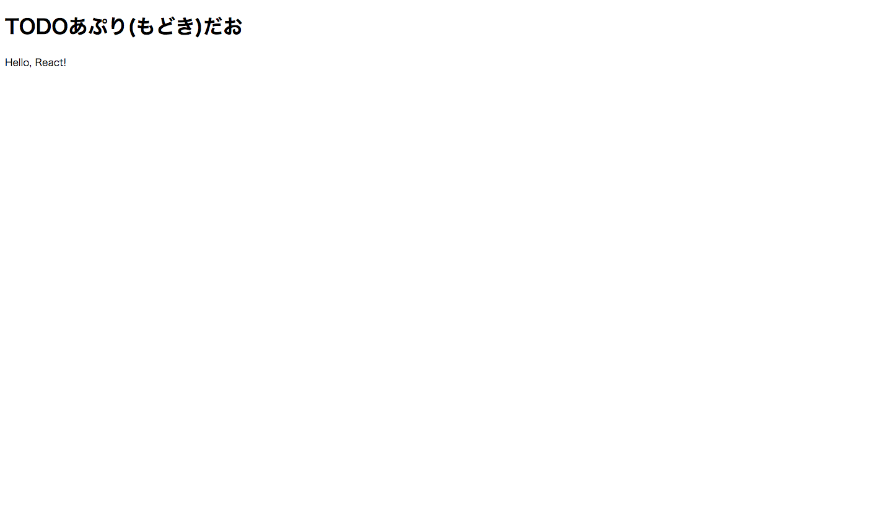

# React-Hands-on

2016/06/23 にチーム内で予定しているReactのハンズオンのために作ったもの。
今回、基本的なところをやりたいのでes6は使いません!

## ReactでTodoアプリ(もどき)つくるよん∧( 'Θ' )∧

### このアプリでできる ~~ようになりたい~~ こと

- タスクの追加
- タスクの表示
<<<<<<< HEAD
=======
- ~~タスク完了させるやつ~~ 未実装

保存機能はつけません。viewだけにしたいので。

23日 07:00 現在、タスク完了の機能を実装まだできていないです。  
check boxをクリックしたら打ち消し線が引かれている感じのやつをやりたい。(願望)

## 準備

- `$ git clone https://github.com/geechs-kshimabukuro/React-Hands-on.git`
- `$ cd React-Hands-on`
- `$ npm install`

## Step1


- まずはindex.htmlを作ってあげましょう∧( 'Θ' )∧

		index.html
		<!DOCTYPE html>
		<html>
			<head>
				<meta charset="utf-8">
				<title>TODOアプリもどきだお∧( 'Θ' )∧</title>

				
				
				<link rel="stylesheet" href="./css/style.css">
			</head>
			<body>

				<h1>TODOあぷり(もどき)だお</h1>

				

				
			</body>
		</html>

- 次に、src/ にtodo.jsxを作ってあげましょう。

		src/todo.jsx
		ReactDOM.render(
			
Hello, React!
,
			document.getElementById('app')
		);

- `$ gulp`

できたかぬ?

## Step2

表示できたところで、今度はTODOアプリの枠を作っていきます。

ここからは todo.jsx を編集していきます。

		src/todo.jsx
		var TODOApp = React.createClass({
			render: function() {
				return (
					

						ここがアプリになるよ
					

					);
			}
		});

		ReactDOM.render(
			<TODOApp />,
			document.getElementById('app')
		);

これで、アプリの枠ができました。続いてtaskを追加する場所と追加されたtaskを表示するための枠を作ります。

		src/todo.jsx
		var TODOForm = React.createClass({
			render: function() {
				return (
					

						ここがフォームだお
					

				);
			}
		});

		var TODOList = React.createClass({
			render: function() {
				return (
					

						ここがリストだよ
					

				);
			}
		});

		var TODOApp = React.createClass({
			render: function() {
				return (
					

						<TODOForm />
						<TODOList />
					

					:
					:

## Step3

枠ができたので、今度は追加されたtaskが表示できるようにしましょう。

- まずは、追加されたtaskを管理する配列をつくりますϵ( 'Θ' )϶

		src/todo.jsx
		:
		:
		var TODOApp = React.createClass({
			getInitialState: function() {
				return { todos: [{id: Date.now(), task: 'hoge', status: 0}] }
			},
			:
			:

- 次に、追加されたtaskが評議できるようにします。

		src/todo.jsx
		:
		:
		var TODOList = React.createClass({
			render: function() {
				var createTask = function(todo) {
					return (
						<li key={todo.id}>
							<input type="checkbox"/>
							{todo.task}
						</li>
					);
				}

				return (
					

						<ul>
							{this.props.todos.map(createTask)}
						</ul>
					

				);
			}
		});

		var TODOApp = React.createClass({
			getInitialState: function() {
				return { todos: [{id: Date.now(), task: 'hoge', status: 0}] }
			},
			render: function() {
				

					<TODOForm />
					<TODOList todos={this.state.todos}/>
				

			}
		});
		:
		:

>>>>>>> 150d0304a0d3836938c7ddf38427ebbdd131b3eb
